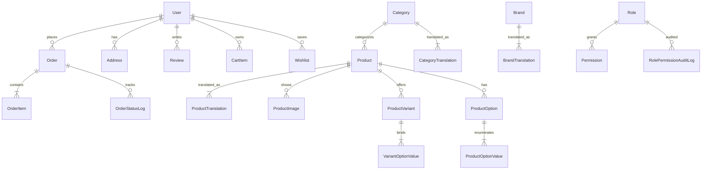

> 一个面向跨境零售场景的全栈电商平台，UI 参照 Amazon Storefront + Seller Central 双端形态重新打磨。
> 基于 **Laravel 13 / PHP 8.5 / MySQL / Bootstrap 5**，自研 i18n、RBAC 权限体系、Stripe 支付、SMS 验证码、reCAPTCHA 风控等完整链路。
> 从一份 CRMEB 二开骨架出发，逐模块重写到生产级形态，作为 PHP 开发实战作品集，从 0 到 1 完整落地。

---

## 项目概览

| 维度 | 内容 |
|---|---|
| 技术栈 | Laravel 13 / PHP 8.5 / MySQL 8 (port 3307) / Bootstrap 5 / Blade |
| 代码规模 | 28 个 Eloquent Model / 33 个 migration / 24 个 admin resource 路由 / 完整 RBAC |
| 双端形态 | 前台 Amazon-style storefront / 后台 Seller Central-style 管理端 |
| i18n | 中 / 英 双语，mcamara/laravel-localization / __() 全站 localized |
| 第三方集成 | Stripe 支付 / Twilio SMS 验证码 / Google reCAPTCHA |


> 建议宽度 1280px，存到 docs/screenshots/home.png

---

## 技术栈

### 后端
- **Laravel 13** — 路由 / 中间件 / Blade / Eloquent / Queue
- **PHP 8.5** — 类型系统、readonly properties、match expression 实战
- **MySQL 8** — 33 张表，含 translations 多语言表、audit log 审计表、订单状态流转表
- **Composer** 依赖管理

### 前端
- **Bootstrap 5** — 前台重写为 Amazon-style（dark top bar / 搜索框 / 商品网格 / mega footer）；后台重写为 Seller Central-style（dark top + light sidebar + active 高亮）
- **Bootstrap Icons** — 全站图标统一
- **Blade Templates** — layouts / partials / component 分层
- **Vanilla JS** — 购物车数量加减、结算 AJAX 交互、modal、carousel 等组件

### 安全 / 权限
- **RBAC** — 5 类 admin role（super-admin / admin / operations / customer-service / viewer），细到按钮的 permission 中间件 + role 校验
- **Audit Log** — RolePermissionAuditLog 全量审计，记录 when / actor / action / subject
- **reCAPTCHA** — 登录 / 注册风控
- **Twilio SMS** — 手机号验证码
- **Stripe Checkout** — 真实支付链路
- **bcrypt / Hash::make** — 密码加密

>

> 数据库 ER 图 / schema 设计截图
> 可用 MySQL Workbench 导出，或 dbdiagram.io 生成

---

## 核心架构设计

### 数据模型

共 28 个 Eloquent Model，覆盖：

```
User / Address / Brand / Category / Product / ProductImage / ProductTranslation
ProductOption / ProductOptionValue / ProductVariant / VariantOptionValue
CategoryTranslation / BrandTranslation
Order / OrderItem / OrderStatusLog
CartItem / Coupon / RefundRequest
Wishlist / RecentlyViewed / Review / UserPoints / PointLog
Role / Permission / RolePermissionAuditLog
SystemConfig
```

#### 实体关系图



### 路由组织

前台公开页 + auth 守卫后台分离：

| 路由 | Controller | 说明 |
|---|---|---|
| GET / | HomeController@index | 首页（hero carousel + category tiles + lightning deals） |
| GET /shop | ProductController@index | 商品列表筛选 |
| GET /product/{slug} | ProductController@show | 商品详情，3 级变体 |
| GET /cart | CartController@index | 购物车 + 加减 AJAX 交互 + 推荐 |
| POST /checkout | CheckoutController@placeOrder | 下单 + 优惠券 |
| GET /orders/{order_no} | UserController@orderDetail | 订单详情 + 状态流转 |
| GET /payment/{order_no} | StripePaymentController@createCheckoutSession | Stripe Checkout Session |
| POST /reviews | ReviewController@store | 评价（含图片上传） |
| POST /sms/send | UserController@sendSmsCode | Twilio 验证码 |

后台（admin.* 命名，全部走 auth + role 中间件）：

```php
Route::prefix('admin')->name('admin.')
    ->middleware(['auth', 'role:super-admin,admin,operations,customer-service,viewer'])
    ->group(function () {
        Route::get('/dashboard', [DashboardController::class, 'index'])
            ->middleware('permission:dashboard.view');
        Route::resource('categories', CategoryController::class)
            ->middleware(['permission:category.view',
                         'permission:category.create|permission:category.edit|permission:category.delete']);
        // ... 24 个 admin resource
    });


## 前台视觉重做

这一版是我从 CRMEB 默认样式一刀一刀重写过来的，目标是让买家端贴近 Amazon 的视觉密度。

### 买家端 Storefront

- **Dark top bar**（#131921）+ **暖黄搜索框**（#febd69）+ **左侧分类三级下拉**
- Hero carousel、主推区 + category tiles + Lightning Deals + 商品 grid
- 商品卡片：缩略图 + 标题 + 星级 + 价格 + Prime 标记 + 加购按钮
- 详情页支持 3 级变体组合（颜色 / 容量 / 套装）、缩略图切换、评价区
- Mega footer，4 列链接 + logo + 备案

> [截图占位 4] 买家端首页全貌截图

> [截图占位 5] 商品详情页变体切换截图

### 后台 Seller Central 风格

- **Dark top bar**：logo + 商户名 + user dropdown
- **Light sidebar**：active 项左侧高亮条 + 背景填充 + 图标
- 所有 menu items 用 __() 包裹，中英切换全站生效

> [截图占位 6] 后台 admin dashboard 整页截图

---

## 国际化 i18n

- **mcamara/laravel-localization** 统一前缀路由（/zh/... / /en/...）
- 两个语言文件 lang/zh/messages.php 与 lang/en/messages.php，共 380+ 条
- 所有 Blade 文本统一用 __() 包裹，含前端按钮文案
- 连后台的 status badge（System / Assigned / Removed / Granted / Revoked）和 audit log 动作描述都做了 localized

> [截图占位 7] 中英文切换前后对比截图

---

## 本地运行

需要 PHP 8.5+、MySQL 8+、Composer。

```bash
# 1. 克隆
git clone https://github.com/856376-git/globmall-shop.git
cd globmall-shop

# 2. 安装依赖
composer install

# 3. 配置环境
cp .env.example .env
php artisan key:generate
# 编辑 .env 设置 DB_HOST / DB_PORT=3307 / DB_DATABASE=globmall / DB_USERNAME / DB_PASSWORD
# 并填入 STRIPE / TWILIO / Google reCAPTCHA keys

# 4. 建表
php artisan migrate
php artisan db:seed

# 5. 启动
php artisan serve --port=8080
# 打开 http://127.0.0.1:8080/zh
```

测试账号：
- **前台用户**：注册即可，role = customer，status = 1
- **后台管理员**：admin@globmall.com / 123456

---

## 项目目录结构

```
globmall/
|-- app/
|   |-- Http/Controllers/         # 前台控制器 + Admin/ 后台控制器
|   |-- Models/                   # 28 个 Eloquent 模型
|   `-- ...
|-- database/
|   |-- migrations/               # 33 个 migration，建表 / 索引 / 外键
|   `-- seeders/
|-- resources/
|   |-- lang/{zh,en}/messages.php # 380+ 条 i18n
|   `-- views/
|       |-- layouts/{app,admin}.blade.php
|       |-- partials/{header,footer,product-card}.blade.php
|       |-- home.blade.php        # Storefront
|       |-- shop.blade.php        # 商品列表
|       |-- product.blade.php     # 商品详情
|       |-- cart.blade.php        # 购物车
|       |-- checkout*.blade.php   # 结算流程
|       `-- ...
|-- public/
|   `-- css/
|       |-- amazon-style.css      # 前台 Amazon 风格
|       `-- admin-asc.css         # Seller Central 风格
|-- routes/
|   `-- web.php                   # 24 个 admin resource + 前台路由
`-- legacy-scripts/               # 早期迁移脚本留存
```

### 开发小记

- **前台主题大改**：从 CRMEB 默认模板出发，整页重写成 Amazon + Seller Central 双形态，约 2200 行 CSS 重写 + Blade 重构
- **i18n 修复链路**：旧 messages.php 乱码 + 编码错乱，逐条用 UTF-8 no-BOM 重写，补齐 380+ 条，前台后台 Blade 文案全部对接
- **RBAC 设计落地**：role + permission join 表，每个后台资源拆细粒度（category.view / category.create / category.edit / category.delete），中间件链串起来
- **版本管理**：Git 分支管理 + 推送至 GitHub 公开仓库，处理过 remote + PAT 凭证、credential 与 token 缓存问题

> [截图占位 8] 后台权限管理 / 角色编辑页 + audit log 列表截图

---

## 已交付路线

- [x] Amazon 前台主题
- [x] Seller Central 后台主题
- [x] 全站 i18n
- [x] RBAC + permission 中间件
- [x] Stripe Checkout 支付
- [x] 完整 cart / checkout / order 流程
- [x] 推上 GitHub 公开仓库
- [x] 搜索性能 / 商品分面筛选优化
- [x] 单元测试 / Feature 测试补齐

---

## 作者

GitHub: [@856376-git](https://github.com/856376-git)
项目地址: https://github.com/856376-git/globmall-shop

本项目作为 PHP 开发实战作品集，欢迎交流学习。

---

> [截图占位 9] 整体大拼图：前台 + 后台 + ER + 中英对比 + audit log 拼图
