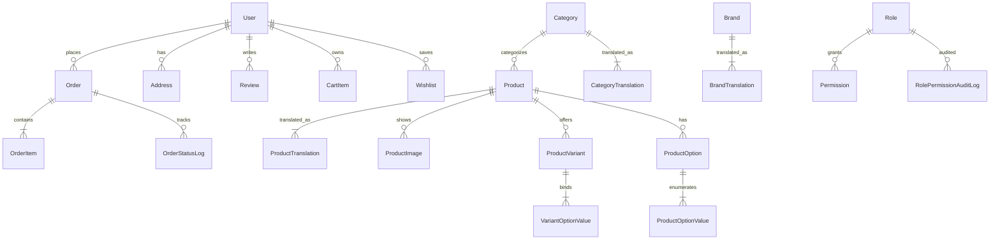

# GlobMall ?????? / Cross-Border E-Commerce Platform

> ??????????????????????? Amazon Storefront + Seller Central ?????
> ?? **Laravel 13 / PHP 8.5 / MySQL / Bootstrap 5**?????? i18n?RBAC ??????????Stripe ???SMS ????reCAPTCHA ???????
> ????? PHP ????????? 0 ? 1 ??????????????

---

## ????

| ? | ?? |
|---|---|
| ??? | Laravel 13 / PHP 8.5 / MySQL 8 (port 3307) / Bootstrap 5 / Blade |
| ???? | 28 ? Eloquent Model / 33 ? migration / 24 ? admin resource ?? / ?? RBAC |
| ???? | ??? Amazon-style storefront / ??? Seller Central-style ?? |
| i18n | ? / ? ?????mcamara/laravel-localization / __() ?? localized? |
| ????? | Stripe ?? / Twilio SMS ??? / Google reCAPTCHA |

> [???? 1] ??????????????
> ?????? 1280px ????? docs/screenshots/home.png

---

## ???

### ??
- **Laravel 13** ? ??????? / ??? / Blade / Eloquent / Queue
- **PHP 8.5** ? ?????readonly properties?match expression ????
- **MySQL 8** ? 33 ???? translations ??????audit log ???????
- **Composer** ????

### ??
- **Bootstrap 5** ? ??????? Amazon-style?dark top bar / ???? / ?????? / mega footer????? Seller Central-style?dark top + light sidebar + active ???
- **Bootstrap Icons** ? ????
- **Blade Templates** ? layouts / partials / component ???
- **Vanilla JS** ? ????????????? AJAX ????????modal?carousel ????

### ?? / ???
- **RBAC** ? 5 ? admin role?super-admin / admin / operations / customer-service / viewer?????? permission ??? + role ???
- **Audit Log** ? RolePermissionAuditLog ???????when / actor / action / subject?
- **reCAPTCHA** ? ?? / ?????
- **Twilio SMS** ? ??????
- **Stripe Checkout** ? ???????
- **bcrypt / Hash::make** ? ????

> [???? 2] ????????? ER ? / schema ??
> ??? MySQL Workbench ???????? dbdiagram.io ??

---

## ???????

### ?????

?? 28 ? Eloquent Model ???

```
User / Address / Brand / Category / Product / ProductImage / ProductTranslation
ProductOption / ProductOptionValue / ProductVariant / VariantOptionValue
CategoryTranslation / BrandTranslation
Order / OrderItem / OrderStatusLog
CartItem / Coupon / RefundRequest
Wishlist / RecentlyViewed / Review / UserPoints / PointLog
Role / Permission / RolePermissionAuditLog
SystemConfig
```

#### ??????



### ????

?????? + auth ?????

| ?? | Controller | ?? |
|---|---|---|
| GET / | HomeController@index | ???hero carousel + category tiles + lightning deals? |
| GET /shop | ProductController@index | ??????? |
| GET /product/{slug} | ProductController@show | ?????3 ???? |
| GET /cart | CartController@index | ??? + ?? AJAX ?? + ??? |
| POST /checkout | CheckoutController@placeOrder | ?? + ??? |
| GET /orders/{order_no} | UserController@orderDetail | ???? + ???? |
| GET /payment/{order_no} | StripePaymentController@createCheckoutSession | Stripe Checkout Session |
| POST /reviews | ReviewController@store | ???????? |
| POST /sms/send | UserController@sendSmsCode | Twilio ??? |

??? (admin.* ????? auth + role ??????)?

```php
Route::prefix('admin')->name('admin.')
    ->middleware(['auth', 'role:super-admin,admin,operations,customer-service,viewer'])
    ->group(function () {
        Route::get('/dashboard', [DashboardController::class, 'index'])
            ->middleware('permission:dashboard.view');
        Route::resource('categories', CategoryController::class)
            ->middleware(['permission:category.view',
                         'permission:category.create|permission:category.edit|permission:category.delete']);
        // ... 24 ? admin resource
    });
```

> [???? 3] ?????????? / admin ??????

---

## ???????

?????????????? Amazon ???????????????

### ??? Storefront

- **Dark top bar**?#131921?+ **?????**?#febd69?+ **????????**
- Hero carousel??????+ category tiles + Lightning Deals + ???? grid
- ?????????? + ?? + ?? + ?? + ?????????
- ??????? 3 ??????? / ???? / ??????
- Mega footer?4 ??? + logo + ???

> [???? 4] ?????????????

> [???? 5] ?????????????

### ??? Seller Central ????

- **Dark top bar**?logo + merchant name + user dropdown
- **Light sidebar**?active ?????????? + ??
- ?? menu items ? __() ????????????

> [???? 6] ??????admin dashboard ??

---

## ??? i18n

- **mcamara/laravel-localization** ??????? URL?/zh/... / /en/...?
- ?????? lang/zh/messages.php ? lang/en/messages.php?? 380+ ?
- ?? Blade ???? __() ????????????
- ?? admin ?? status badge?System / Assigned / Removed / Granted / Revoked??audit log ?????????????? localized

> [???? 7] ?????????????????

---

## ????

???PHP 8.5+?MySQL 8+?Composer

```bash
# 1. ??
git clone https://github.com/856376-git/globmall-shop.git
cd globmall-shop

# 2. ????
composer install

# 3. ????
cp .env.example .env
php artisan key:generate
# ?? .env ?? DB_HOST / DB_PORT=3307 / DB_DATABASE=globmall / DB_USERNAME / DB_PASSWORD
# ????? STRIPE / TWILIO / Google reCAPTCHA keys

# 4. ???
php artisan migrate
php artisan db:seed

# 5. ??
php artisan serve --port=8080
# ?? http://127.0.0.1:8080/zh
```

?????
- **????**???????role = customer?status = 1?
- **???**?admin@globmall.com / 123456

---

## ?????????

```
globmall/
|-- app/
|   |-- Http/Controllers/         # ??????? Admin/ ????
|   |-- Models/                   # 28 ? Eloquent ??
|   `-- ...
|-- database/
|   |-- migrations/               # 33 ? migration????? / ?????
|   `-- seeders/
|-- resources/
|   |-- lang/{zh,en}/messages.php # 380+ ? i18n
|   `-- views/
|       |-- layouts/{app,admin}.blade.php
|       |-- partials/{header,footer,product-card}.blade.php
|       |-- home.blade.php        # Storefront
|       |-- shop.blade.php        # ????
|       |-- product.blade.php     # ????
|       |-- cart.blade.php        # ???
|       |-- checkout*.blade.php   # ????
|       `-- ...
|-- public/
|   `-- css/
|       |-- amazon-style.css      # ??? Amazon ??
|       `-- admin-asc.css         # Seller Central ??
|-- routes/
|   `-- web.php                   # 24 ? admin resource + ?????
`-- legacy-scripts/               # ???????????
```

### ??????

- **??????**?? CRMEB ???????????? Amazon ??? Seller Central ?????? 2200 ??? CSS ??? Blade ????
- **i18n ????**??? messages.php ???????????? UTF-8 no-BOM ???? 380+ ??????? Blade ????????
- **RBAC ??**?role + permission ?? join??????? resource ???category.view / category.create / category.edit / category.delete??????????
- **????**?Git ??????? push ? GitHub ?????? remote + PAT ??????? credential ? token ????

> [???? 8] ?????????? / ?????????????????

---

## ????

- [x] Amazon ??????
- [x] Seller Central ????
- [x] ???? i18n
- [x] RBAC + permission middleware
- [x] Stripe Checkout ??
- [x] ?? cart / checkout / order ??
- [x] ?? GitHub ????
- [ ] ??? / ??????????????
- [ ] ???? / Feature ????
- [ ] CSV ?????? / ????

---

## ??

GitHub: [@856376-git](https://github.com/856376-git)
????: https://github.com/856376-git/globmall-shop

????? PHP ????????????????????

---

> [???? 9] ???????????????????????????? audit log ???
